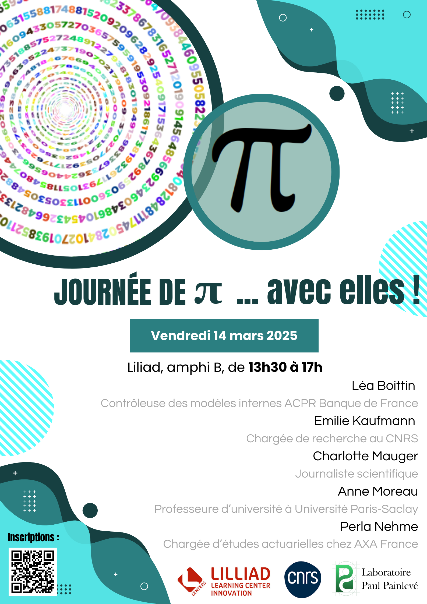

Since 2017, I've been an assistant professor (maîtresse de conférence) at [Laboratoire Paul Painlevé](https://math.univ-lille.fr/) (Université de Lille).
I am interested in applied and computational statistics. More precisely, my research interests lie in:
 - parametric estimation in complex models
 - nonlinear mixed-effects models
 - latent variables models
 - EM-type algorithms
 - bayesian analysis and MCMC algorithms
 
 I've mostly worked with applications in medicine, agronomy, ecology, and plant science.

### News
 

 - March 14th 2025 : let's celebrate international   day and women in maths! Evénement à destination des étudiant.e.s de licence, autour d"un exposé grand public, d'une table ronde sur les métiers des mathématiques et de l'exposition [*Mathématique, informatique, avec elles !*](https://femmes-et-maths.fr/femmes-en-maths/maths-info-avec-elles/). Inscription et programme [ici](https://www.mathconf.org/lilloises2025).
 
 - December 5th 2024 : PhD defense of Tom Guédon (at Institut Mathématique d'Orsay).

 
### Current projects
 
 I'm currently part of the ANR-funded project [Stat4Plant](https://stat4plant.mathnum.inrae.fr/), coordinated by [Estelle Kuhn](http://genome.jouy.inra.fr/~ekuhn/), and I also participate in the ANR-funded project [EntrainPark](https://anr.fr/Project-ANR-21-CE28-0011), coordinated by [Anahita Basirat](https://www.basirat.fr/index.html).
 
 More details [here](https://baeyc.github.io/projects/).

  
### Curriculum

You can find my resume [here](files/cv.pdf) (in French).

Between October 2016 and August 2017, I was a post-doctoral student in the [Biomathematics](http://biomathematics.mics.centralesupelec.fr/) team of [MICS laboratory](https://Since 2017, I'm an assistant professor (maître de conférence) at Laboratoire Paul Painlevé (Université of Lille).
).
  
From june 2015 to September 2016, I was a post-doctoral student in the [Center for Environmental and Climate Research](Since 2017, I'm an assistant professor (maître de conférence) at Laboratoire Paul Painlevé (Université of Lille).
) at Lund University (Sweden). I was working on ecosystem services modelling at the landscape scale.

From April 2014 to May 2015, I was a post-doctoral student at the Institut de Modélisation des Systèmes Vivants ([IMSV](https://www.universite-paris-saclay.fr/en/research/project/lidex-imsv), Paris-Saclay). I was working on modelling of genetotypic variability in plant populations.

From 2010 to 2014, I was a PhD student in Ecole Centrale Paris, in the [Digiplante](http://digiplante.mas.ecp.fr/) team of MAS laboratory. I defended my thesis on February 28th 2014. Here is a [link](https://tel.archives-ouvertes.fr/tel-00985747) to the manuscript (in french).
